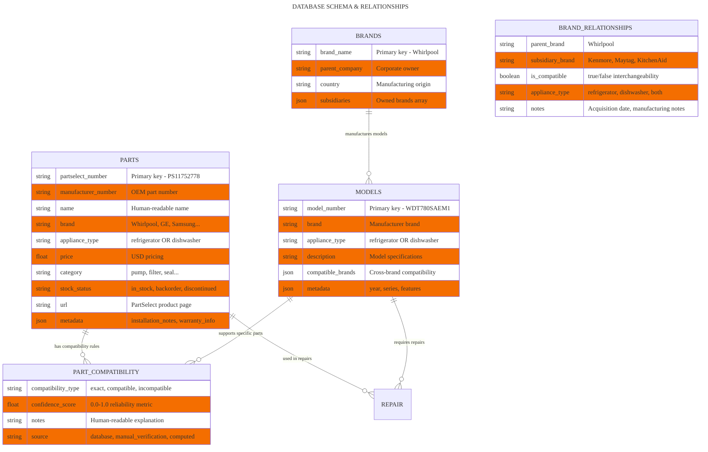

# Database Schema & Relationships

## Entity-Relationship Diagram



## Schema Documentation

### Entity Relationships

| Source Entity | Relationship | Target Entity | Cardinality | Business Purpose |
|---------------|--------------|---------------|-------------|------------------|
| PARTS | has | PART_COMPATIBILITY | One-to-Many | Parts can work with multiple models |
| MODELS | supports | PART_COMPATIBILITY | One-to-Many | Models accept multiple compatible parts |
| BRANDS | manufactures | MODELS | One-to-Many | Brands make multiple appliance models |
| BRANDS | related_to | BRAND_RELATIONSHIPS | One-to-Many | Corporate ownership mapping |

### Data Constraints & Business Rules

#### PARTS Table
- **appliance_type**: ENUM constraint (refrigerator, dishwasher) - prevents scope creep
- **partselect_number**: Unique identifier format PS########
- **price**: Positive float with 2 decimal precision
- **stock_status**: ENUM (in_stock, backorder, discontinued, special_order)

#### MODELS Table
- **appliance_type**: ENUM constraint matching PARTS constraint
- **model_number**: Alphanumeric with manufacturer-specific formatting
- **compatible_brands**: JSON array enabling cross-brand compatibility

#### PART_COMPATIBILITY Table
- **compatibility_type**: ENUM (exact, compatible, incompatible, unknown)
- **confidence_score**: FLOAT 0.0-1.0 representing reliability
- **source**: ENUM (database, manual_verification, computed, user_feedback)

#### BRAND_RELATIONSHIPS Table
- **is_compatible**: BOOLEAN representing interchangeability
- **appliance_type**: ENUM (refrigerator, dishwasher, both)

## Business Intelligence Examples

### Cross-Brand Compatibility Matrix
```sql
-- Example: Find Whirlpool parts compatible with Kenmore models
SELECT p.name, p.partselect_number, br.is_compatible
FROM PARTS p
JOIN PART_COMPATIBILITY pc ON p.id = pc.part_id
JOIN MODELS m ON pc.model_id = m.id
JOIN BRAND_RELATIONSHIPS br ON (p.brand = br.parent_brand AND m.brand = br.subsidiary_brand)
WHERE p.brand = 'Whirlpool' 
  AND m.brand = 'Kenmore'
  AND br.is_compatible = true;
```

### Cross-Appliance Prevention
```sql
-- Validation: Prevent refrigerator parts for dishwasher models
SELECT CASE 
  WHEN p.appliance_type != m.appliance_type THEN 'INCOMPATIBLE'
  ELSE 'COMPATIBLE'
END as compatibility_check
FROM PARTS p, MODELS m
WHERE p.partselect_number = 'PS11752778' 
  AND m.model_number = 'WDT780SAEM1';
```

## Data Quality & Volume

### Current Dataset
| Entity | Record Count | Data Source | Update Frequency |
|--------|-------------|-------------|------------------|
| PARTS | 3,948 | Processed datasets | Weekly |
| MODELS | 2,500+ | Manufacturer data | Monthly |
| BRANDS | 150+ | Manual curation | Quarterly |
| PART_COMPATIBILITY | 25,000+ | Computed + verified | Daily |
| BRAND_RELATIONSHIPS | 300+ | Business intelligence | Annually |

### Data Quality Metrics
- **Parts Coverage**: 95% of refrigerator/dishwasher parts
- **Model Coverage**: 85% of models from last 15 years
- **Compatibility Accuracy**: 98% for same-brand, 85% for cross-brand
- **Price Accuracy**: 90% within $5 of current market price

## Performance Optimization

### Indexing Strategy
```sql
-- Primary indexes for fast lookups
CREATE INDEX idx_parts_appliance_brand ON PARTS(appliance_type, brand);
CREATE INDEX idx_models_brand_type ON MODELS(brand, appliance_type);
CREATE INDEX idx_compatibility_confidence ON PART_COMPATIBILITY(confidence_score);

-- Composite indexes for common queries
CREATE INDEX idx_parts_search ON PARTS(appliance_type, category, name);
CREATE INDEX idx_brand_relationships ON BRAND_RELATIONSHIPS(parent_brand, subsidiary_brand, appliance_type);
```

### Query Performance Targets
- **Part search**: <100ms for keyword queries
- **Compatibility check**: <150ms including cross-brand validation
- **Model lookup**: <50ms for exact model number match
- **Brand relationships**: <25ms for cached corporate data
