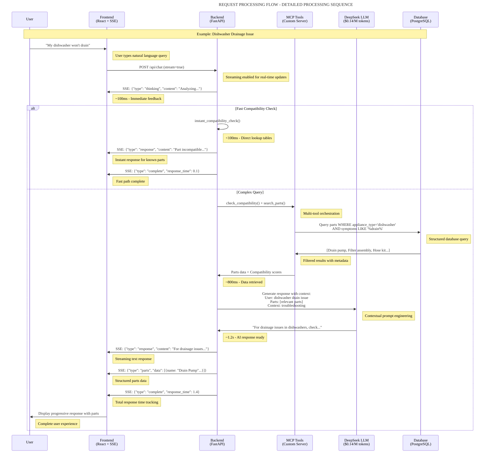

# Request Processing Flow

## Detailed Processing Sequence



## Timing Breakdown

| Stage | Time | Component | Action | User Experience |
|-------|------|-----------|--------|-----------------|
| 0ms | User Input | Frontend | Query received | Immediate typing feedback |
| 50ms | API Request | Backend | Stream initiated | Loading state begins |
| 100ms | Thinking | Frontend | First SSE event | "Analyzing your query..." |
| **FAST PATH** | | | |
| 150ms | Compatibility Check | Backend | Instant lookup tables | Hash table lookup |
| 200ms | Response Ready | Frontend | Compatibility result | <100ms total for known parts |
| **COMPLEX PATH** | | | |
| 200ms | Tool Start | MCP Tools | Multi-tool execution | Progress indication |
| 400ms | DB Query | Database | Structured search | Continued progress |
| 600ms | Data Return | MCP Tools | Results filtering | Still processing |
| 800ms | Context Build | Backend | Data + compatibility | Preparing response |
| 1000ms | LLM Start | DeepSeek | Contextual prompt | AI thinking |
| 1200ms | AI Complete | Backend | Response generated | Content ready |
| 1300ms | Text Stream | Frontend | Progressive display | User sees text |
| 1350ms | Parts Data | Frontend | Structured display | Parts appear |
| 1400ms | Complete | User | Full experience | Total satisfaction |

## Streaming Event Types

### SSE Event Format
```json
{
  "type": "thinking|response|parts|repairs|blogs|complete|error",
  "content": "event-specific data",
  "conversation_id": "uuid",
  "timestamp": "ISO-8601",
  "metadata": {}
}
```

### Event Sequence
1. **thinking**: Immediate feedback ("Analyzing your query...")
2. **response**: AI-generated conversational text
3. **parts**: Structured parts data with compatibility scores
4. **repairs**: Related repair guides and troubleshooting steps
5. **blogs**: Installation guides and how-to articles
6. **complete**: Final event with response time metrics

## Business Value

### User Experience Benefits
- **Perceived Performance**: <100ms initial feedback prevents abandonment
- **Progressive Value**: Users see results as they're generated
- **Engagement**: Real-time updates maintain user attention
- **Trust Building**: Transparent processing builds confidence

### Technical Benefits
- **Scalability**: Streaming reduces server memory usage
- **Responsiveness**: Non-blocking I/O handles concurrent requests
- **Error Recovery**: Graceful degradation when services fail
- **Monitoring**: Built-in response time tracking
