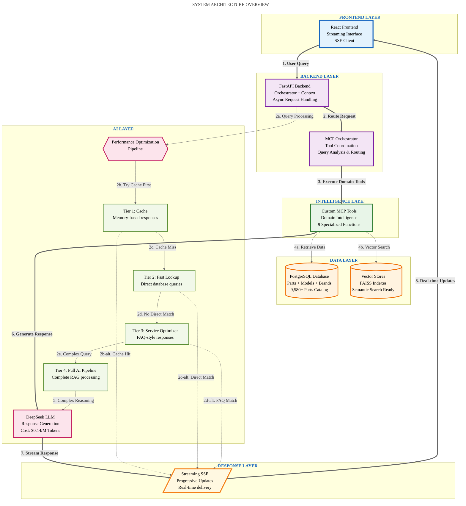

# System Architecture Overview

## High-Level Architecture Flow

## Component Legend

| Layer | Component | Performance Target | Business Value |
|-------|-----------|-------------------|----------------|
| **Frontend** | React Frontend | <50ms UI updates | Real-time user feedback |
| **Backend** | FastAPI Backend | 100+ concurrent users | Scalable request handling |
| **Backend** | MCP Orchestrator | <100ms tool routing | Intelligent query analysis |
| **Intelligence** | Custom MCP Tools | <200ms average execution | Appliance domain expertise |
| **Data** | PostgreSQL Database | <150ms queries | 3,948 parts catalog access |
| **Data** | Vector Stores | <200ms semantic search | Natural language part discovery |
| **AI** | DeepSeek LLM | $0.14/M tokens | Cost-effective response generation |
| **Response** | Streaming SSE | <80ms chunk delivery | Progressive response updates |

## Architecture Benefits

### Layered Approach
- **Separation of concerns**: UI handles display, backend handles logic, MCP handles domain tools, providers handle data
- **Scalability**: Each layer can be scaled independently based on load patterns
- **Maintainability**: Changes to one layer don't cascade through the entire system

### Performance Optimization
- **Multi-tier response system**: Cache → Fast Lookup → Service Optimizer → Full AI Pipeline
- **Progressive degradation**: System provides value even when external services fail
- **Cost optimization**: Avoid expensive LLM calls for simple/repeated queries

### Technical Innovation
- **Custom MCP implementation**: Domain-specific appliance intelligence
- **Real-time streaming**: Server-Sent Events for immediate user feedback
- **Enterprise patterns**: Modular provider architecture for technology flexibility
